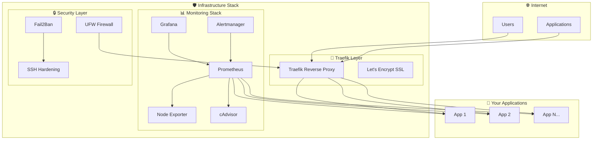

# Universal Infrastructure Stack 🚀

<div align="center">


**A production-ready, universal infrastructure stack for deploying any application with enterprise-grade monitoring, security, and automation.**

[](LICENSE)
[](https://www.docker.com/)
[](https://traefik.io/)
[](https://prometheus.io/)

</div>

## ✨ Features

- 🔄 **Universal Application Support** - Deploy any containerized application
- 🛡️ **Enterprise Security** - Automated hardening, fail2ban, firewall
- 📊 **Comprehensive Monitoring** - Prometheus, Grafana, Alertmanager
- 🔐 **Automatic HTTPS** - Let's Encrypt SSL certificates
- 🚀 **One-Click Deployment** - Automated setup scripts
- 📈 **Production Ready** - Battle-tested configurations
- 🔧 **Easy Management** - Unified control scripts
- 📚 **Complete Documentation** - Step-by-step guides

## 🏗️ Architecture

<div align="center">



</div>

### 📁 Project Structure

```
infrastructure/
├── 🛡️ traefik/              # Universal reverse proxy & SSL
│   ├── docker-compose.yml   # Traefik configuration
│   ├── Makefile             # Management commands
│   └── README.md            # Traefik documentation
├── 📊 monitoring/            # Universal monitoring stack
│   ├── docker-compose.yml   # Monitoring services
│   ├── prometheus.yml       # Metrics collection
│   ├── alert_rules.yml      # Alert definitions
│   ├── alertmanager.yml     # Notification routing
│   ├── Makefile             # Management commands
│   └── docs/                # Complete documentation
├── 🔧 manage.sh             # Unified management script
├── 🔒 setup-security.sh     # Automated security hardening
├── 🛡️ security-check.sh     # Security validation
└── 📚 Documentation files   # Setup guides & best practices
```

## 🚀 Quick Start

### ⚡ 30-Second Setup

```bash
# Clone and setup
git clone <your-repo-url>
cd infrastructure

# One-command deployment
make quick-start service=all
```

### 🔧 Manual Setup (Recommended)

<details>
<summary><strong>📋 Prerequisites</strong></summary>

- Ubuntu 20.04+ or Debian 11+
- Docker & Docker Compose
- Domain name pointing to your server
- Root or sudo access

</details>

#### 1️⃣ **Setup Traefik (Reverse Proxy)**

```bash
cd traefik
make install
nano env.traefik  # Configure domain and email
make start
```

#### 2️⃣ **Setup Monitoring**

```bash
cd ../monitoring
make install
nano env.monitoring  # Configure passwords
make start
```

#### 3️⃣ **Verify Installation**

```bash
# Check all services
make status service=all

# View logs
make logs service=all
```

### 🎯 **What You Get**

After setup, you'll have:

- ✅ **Automatic HTTPS** for all services
- ✅ **Production monitoring** with Prometheus & Grafana
- ✅ **Security hardening** with firewall & fail2ban
- ✅ **Unified management** with single commands
- ✅ **Ready for your applications**

## 🔌 Application Integration

### 🚀 **Deploy Your Application**

Add your application to the infrastructure in 3 simple steps:

#### 1️⃣ **Add to Traefik Network**

```yaml
# In your app's docker-compose.yml
networks:
  - traefik

labels:
  - "traefik.enable=true"
  - "traefik.http.routers.yourapp.rule=Host(`yourdomain.com`)"
  - "traefik.http.routers.yourapp.entrypoints=websecure"
  - "traefik.http.routers.yourapp.tls.certresolver=letsencrypt"
```

#### 2️⃣ **Enable Monitoring**

```yaml
# Add metrics endpoint
labels:
  - "traefik.http.routers.yourapp-metrics.rule=Host(`yourdomain.com`) && PathPrefix(`/metrics`)"
  - "traefik.http.routers.yourapp-metrics.middlewares=metrics-auth"
```

#### 3️⃣ **Deploy & Access**

```bash
# Deploy your app
docker-compose up -d

# Access via HTTPS
https://yourdomain.com
```

### 📊 **Automatic Monitoring**

Your application will automatically be monitored:

- ✅ **Metrics Collection** - Prometheus scrapes `/metrics`
- ✅ **Dashboards** - Grafana visualizations
- ✅ **Alerts** - Telegram notifications
- ✅ **Performance** - Response time & error tracking

## 📊 Monitoring & Observability

<div align="center">

| Service | Purpose | Access URL |
|---------|---------|------------|
| 🔍 **Prometheus** | Metrics collection & alerting | `https://yourdomain.com/prometheus` |
| 📈 **Grafana** | Dashboards & visualization | `https://yourdomain.com/grafana` |
| 🚨 **Alertmanager** | Alert routing & notifications | `https://yourdomain.com/alertmanager` |
| 🖥️ **Node Exporter** | System metrics | `https://yourdomain.com/node-exporter` |
| 🐳 **cAdvisor** | Container metrics | `https://yourdomain.com/cadvisor` |

</div>

### 🎯 **What's Monitored**

- ✅ **Application Performance** - Response times, error rates, throughput
- ✅ **System Resources** - CPU, memory, disk, network
- ✅ **Container Health** - Resource usage, restarts, logs
- ✅ **Security Events** - Failed logins, suspicious activity
- ✅ **Infrastructure** - Service availability, SSL certificates

### 📱 **Smart Notifications**

- 🔥 **Critical Alerts** - Service down, security breaches
- ⚠️ **Warning Alerts** - High resource usage, slow responses
- 📊 **Daily Reports** - Performance summaries
- 🔔 **Telegram Integration** - Real-time notifications

## 🔧 Management & Operations

### 🎮 **Unified Control**

```bash
# 🚀 Start everything
make start service=all

# 📊 Check status
make status service=all

# 📝 View logs
make logs service=all

# 🔄 Restart services
make restart service=all

# 🛑 Stop everything
make stop service=all
```

### 🛠️ **Individual Service Management**

<details>
<summary><strong>🛡️ Traefik Management</strong></summary>

```bash
cd traefik
make start      # Start Traefik
make stop       # Stop Traefik
make restart    # Restart Traefik
make logs       # View logs
make status     # Check status
```

</details>

<details>
<summary><strong>📊 Monitoring Management</strong></summary>

```bash
cd monitoring
make start      # Start monitoring stack
make stop       # Stop monitoring stack
make restart    # Restart monitoring stack
make logs       # View logs
make status     # Check status
make clean      # Clean data (⚠️ destructive)
```

</details>

### 🔍 **Health Checks**

```bash
# Check all services
make status service=all

# Check specific service
make status service=traefik
make status service=monitoring
```

## 🔒 Enterprise Security

### 🛡️ **Automated Security Hardening**

<div align="center">

| Security Layer | Protection | Status |
|----------------|------------|--------|
| 🔐 **SSH Hardening** | Key-only auth, fail2ban | ✅ Automated |
| 🚫 **Firewall** | UFW with minimal ports | ✅ Automated |
| 🛡️ **Fail2Ban** | Brute force protection | ✅ Automated |
| 🔄 **Auto Updates** | Security patches | ✅ Automated |
| 📊 **Security Monitoring** | Event logging & alerts | ✅ Automated |

</div>

### ⚡ **One-Command Security Setup**

<details>
<summary><strong>⚠️ CRITICAL: Read Before Running</strong></summary>

**The security script disables root access!** Create a new user first:

```bash
# 1. Create new user (as root)
sudo su -
adduser yourusername
usermod -aG sudo yourusername

# 2. Setup SSH keys for new user
su - yourusername
mkdir -p ~/.ssh
chmod 700 ~/.ssh
nano ~/.ssh/authorized_keys  # Paste your public key here
chmod 600 ~/.ssh/authorized_keys

# 3. Test new user access
exit
ssh yourusername@your-server-ip

# 4. Run automated security setup
./setup-security.sh [ssh_port] [ssh_user]

# Example:
./setup-security.sh 2222 yourusername
```

</details>

### 🔍 **Security Validation**

```bash
# Run security check
./security-check.sh

# Check firewall status
sudo ufw status

# Check fail2ban status
sudo fail2ban-client status
```

### 🚨 **Security Monitoring**

- ✅ **Failed Login Attempts** - Real-time alerts
- ✅ **Suspicious Activity** - Automated detection
- ✅ **Port Scanning** - Blocked automatically
- ✅ **SSL Certificate Expiry** - Proactive warnings
- ✅ **Service Availability** - Continuous monitoring

## 🌐 Service Access

<div align="center">

| Service | URL | Purpose | Auth |
|---------|-----|---------|------|
| 🛡️ **Traefik Dashboard** | `https://yourdomain.com/traefik` | Reverse proxy management | Basic Auth |
| 🔍 **Prometheus** | `https://yourdomain.com/prometheus` | Metrics & alerts | Basic Auth |
| 📈 **Grafana** | `https://yourdomain.com/grafana` | Dashboards | Basic Auth |
| 🚨 **Alertmanager** | `https://yourdomain.com/alertmanager` | Alert management | Basic Auth |
| 🖥️ **Node Exporter** | `https://yourdomain.com/node-exporter` | System metrics | Basic Auth |
| 🐳 **cAdvisor** | `https://yourdomain.com/cadvisor` | Container metrics | Basic Auth |

</div>

**🔒 Security**: All services use HTTPS + Basic Authentication. Internal ports are NOT exposed externally.

## 📚 Documentation & Support

### 📖 **Complete Documentation**

- 🛡️ **[Traefik Setup](traefik/README.md)** - Reverse proxy configuration
- 📊 **[Monitoring Setup](monitoring/README.md)** - Full monitoring guide
- 🌐 **[DNS Configuration](DNS_SETUP.md)** - Domain setup guide
- 🔒 **[Security Setup](SECURITY.md)** - Security hardening guide
- 🏗️ **[Security Architecture](SECURITY_ARCHITECTURE.md)** - Security design

### 🆘 **Getting Help**

<details>
<summary><strong>🚨 Common Issues & Solutions</strong></summary>

#### **SSL Certificate Issues**
```bash
# Check domain DNS
nslookup yourdomain.com

# Check Traefik logs
cd traefik && make logs

# Verify Let's Encrypt limits
https://crt.sh/?q=yourdomain.com
```

#### **Authentication Issues**
```bash
# Regenerate auth hashes
cd monitoring && ./generate-auth.sh

# Check environment variables
cat monitoring/env.monitoring
```

#### **Service Not Accessible**
```bash
# Check Traefik labels
docker inspect your-container

# Verify network configuration
docker network ls
docker network inspect traefik
```

</details>

### 🔧 **Customization**

<details>
<summary><strong>🎨 Adding Custom Dashboards</strong></summary>

1. Create JSON dashboard files in `monitoring/grafana/dashboards/`
2. Restart monitoring: `cd monitoring && make restart`
3. Access Grafana to import dashboards

</details>

<details>
<summary><strong>🚨 Adding Custom Alerts</strong></summary>

1. Edit `monitoring/alert_rules.yml`
2. Restart monitoring: `cd monitoring && make restart`
3. Test alerts in Alertmanager

</details>

## 🤝 Contributing

We welcome contributions! Please see our [Contributing Guide](CONTRIBUTING.md) for details.

### 🏆 **Contributors**

See [CONTRIBUTORS.md](CONTRIBUTORS.md) for the amazing people who made this possible.

## 📄 License

This project is licensed under the MIT License - see the [LICENSE](LICENSE) file for details.

---

<div align="center">

**⭐ Star this repository if you found it helpful!**

[](https://github.com/your-username/infrastructure)
[](https://github.com/your-username/infrastructure)

Made with ❤️ for the DevOps community

</div>
